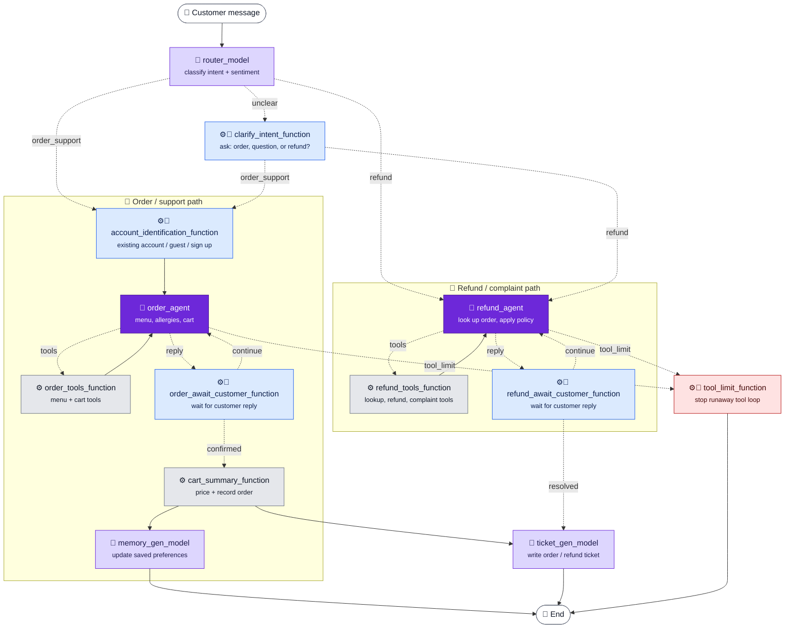
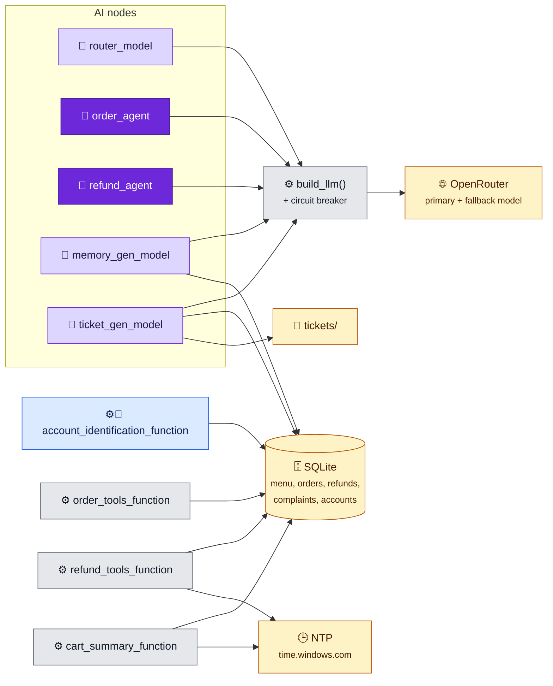

# Architecture

The support system is a LangGraph state machine (`src/customer_support_fde/graph.py`). Every
node reads and writes one shared `SupportState` (`state.py`). This document shows which
components use AI and which are plain code, and what each one does.

## Node naming convention

The end of a node's name says what kind of node it is:

| Suffix | Kind | AI? | Meaning |
|---|---|---|---|
| `_agent` | 🤖 Agent | Yes | An LLM that decides what to do, calls tools, and loops until it is done. |
| `_model` | 🧠 Model | Yes | Makes one LLM call for a fixed job (classify or extract), with no tools. |
| `_function` | ⚙️ Function | No | Plain Python. Deterministic; never calls an LLM. |

⚙️👤 marks a function that pauses the graph (a LangGraph `interrupt`) to wait for the customer's
reply.

These names appear in `graph.py`, in trajectory tests, and as span names in Phoenix traces.
The Python functions and modules keep their original names (for example, the `order_agent`
node runs `call_model` in `nodes/order_support_agent.py`).

## Workflow diagram

Solid arrows always run. Dotted arrows are conditional; each label is the router value that
selects it.

**Colors:** dark purple = 🤖 agent (AI) · light purple = 🧠 model (AI) · grey = ⚙️ function ·
blue = ⚙️👤 function that waits for the customer · red = ⚙️🛑 guard.

The `reply` edges are LangGraph's `__end__` result from `route_after_agent`: the agent made no
tool call, so its message goes to the customer. `cart_summary_function` fans out:
`ticket_gen_model` and `memory_gen_model` run in parallel.

## External dependencies

Not shown: 📡 **Arize Phoenix**. Every node run and every LLM call is traced as a span, and
every WARNING+ log is attached to the current span (`tracing.py`).

## AI vs non-AI at a glance

| Node | Kind | AI? | What the LLM does |
|---|---|---|---|
| `router_model` | 🧠 Model | Yes | Classifies destination + sentiment (structured output) |
| `clarify_intent_function` | ⚙️👤 Function | No | — |
| `account_identification_function` | ⚙️👤 Function | No | — |
| `order_agent` | 🤖 Agent | Yes | Chats, picks tools, summarizes long history |
| `order_tools_function` | ⚙️ Function | No | — |
| `order_await_customer_function` | ⚙️👤 Function | No | — |
| `cart_summary_function` | ⚙️ Function | No | — |
| `memory_gen_model` | 🧠 Model | Yes | Extracts likes / dislikes / allergies (structured output) |
| `refund_agent` | 🤖 Agent | Yes | Chats, picks tools, summarizes long history |
| `refund_tools_function` | ⚙️ Function | No | — (refund eligibility is decided by code, not the LLM) |
| `refund_await_customer_function` | ⚙️👤 Function | No | — |
| `ticket_gen_model` | 🧠 Model | Refund tickets only | Extracts the customer's issue for refund tickets; order tickets are plain code |
| `tool_limit_function` | ⚙️🛑 Function | No | — |

The LLM never decides money: refund eligibility and amounts come from `refund_policy.evaluate()`
(called by the `process_refund_request` tool). Prices and totals come from the menu table.

## Components

### 🧠 `router_model`
- **Code:** `router_agent()` in `nodes/router_agent.py`
- **Purpose:** Entry point. Decides whether the message is an order/support question, a
  refund/complaint, or unclear, and reads the customer's sentiment.
- **Inputs:** `user_query`
- **Outputs:** `destination` (`order_support` / `refund` / `unclear`), `sentiment` (kept only for
  the refund path; set to `None` for `order_support`)
- **Dependencies:** `build_llm()` → OpenRouter
- **AI usage:** One LLM call with structured output (`RouterDecision`). If the output doesn't
  match the schema, falls back to `unclear` so the customer is asked.

### ⚙️👤 `clarify_intent_function`
- **Code:** `clarify_intent()` in `nodes/clarify_intent.py`
- **Purpose:** When the router is unsure, asks the customer to pick 1 (order), 2 (question),
  or 3 (refund), repeating until the answer is valid.
- **Inputs:** `user_query`, `sentiment`; customer reply via `interrupt`
- **Outputs:** `destination` (`order_support` / `refund`), `sentiment`
- **Dependencies:** none
- **AI usage:** None

### ⚙️👤 `account_identification_function`
- **Code:** `account_identification_node()` in `nodes/account_identification_node.py`
- **Purpose:** Before ordering, lets the customer use an existing account, continue as a guest,
  or sign up. An unknown account number shows a recovery menu.
- **Inputs:** customer replies via `interrupt`
- **Outputs:** `account_number`, `account_preferences`
- **Dependencies:** SQLite `accounts` (`db.get_account`, `db.create_account`); sign-up uses NTP
  for the timestamp. A database error stops the workflow (generic error message).
- **AI usage:** None

### 🤖 `order_agent`
- **Code:** `call_model()` in `nodes/order_support_agent.py`
- **Purpose:** The order-support conversation: menu questions, ingredients/allergies,
  recommendations, adding/removing cart items, confirming the order.
- **Inputs:** `messages`, `user_query`, `account_preferences`, `order_conversation_summary`
- **Outputs:** `messages` (new AI message, possibly with tool calls);
  `order_conversation_summary` when history is condensed
- **Dependencies:** `build_llm()` → OpenRouter; tools in `order_tools_function`
- **AI usage:** LLM with tools bound. Once history passes 40,000 tokens, an extra LLM call
  condenses older messages into a running summary (`condense_history` in `nodes/common.py`).
  Guarded by `tool_limit_function`.

### ⚙️ `order_tools_function`
- **Code:** `order_tools` (`ToolNode`) in `nodes/order_support_agent.py`; tools in
  `tools/menu_tools.py`, `tools/cart_tools.py`
- **Purpose:** Runs the tools `order_agent` asked for: `get_menu`, `get_menu_item`,
  `add_items_to_cart`, `remove_items_from_cart`, `get_cart`, `get_cart_total`,
  `mark_order_confirmed`.
- **Inputs:** tool calls on the last AI message; `menu`, `cart_items`
- **Outputs:** tool result `messages`; `cart_items`, `order_confirmed`
- **Dependencies:** menu data (loaded from SQLite at start); `handle_tool_error` turns a tool
  exception into a "retry" message for the agent
- **AI usage:** None (fuzzy name matching is plain string scoring)

### ⚙️👤 `order_await_customer_function`
- **Code:** `await_customer()` in `nodes/order_support_agent.py`
- **Purpose:** Shows the agent's reply and waits for the customer's next message. Loops back to
  `order_agent` until the order is confirmed.
- **Inputs:** `messages`, `order_confirmed`
- **Outputs:** `messages` (customer's reply), `user_query`
- **Dependencies:** none
- **AI usage:** None

### ⚙️ `cart_summary_function`
- **Code:** `cart_summary_node()` in `nodes/cart_summary_node.py`
- **Purpose:** Prices the confirmed cart, records the order, and shows the recap
  ("Your order has been placed.", `Placed:` time, Order ID).
- **Inputs:** `cart_items`, `menu`
- **Outputs:** `order_summary`, `order_id`, `messages` (recap)
- **Dependencies:** SQLite `orders` (`db.record_order`), NTP (`clock.trusted_now`), restaurant
  timezone for display. Any failure raises `OrderNotPlacedError`.
- **AI usage:** None

### 🧠 `memory_gen_model`
- **Code:** `memory_gen_node()` in `nodes/memory_gen_node.py`
- **Purpose:** After an order, updates the account's saved food preferences.
- **Inputs:** `account_number`, `account_preferences`, `order_conversation_summary`, `messages`
- **Outputs:** none in state; writes preferences to SQLite `accounts`. Skipped for guests.
- **Dependencies:** `build_llm()` → OpenRouter; `db.update_account_preferences`
- **AI usage:** One LLM call with structured output (`_PreferenceExtraction`) that merges old and
  new likes, dislikes, and allergies. A failure is logged, and the order is unaffected.

### 🤖 `refund_agent`
- **Code:** `refund_agent()` in `nodes/refund_agent.py`
- **Purpose:** The refund/complaint conversation: gets the order ID, looks up the order, gathers
  the facts the policy needs, then submits a refund request or logs a complaint.
- **Inputs:** `messages`, `user_query`, `sentiment`, `refund_conversation_summary`
- **Outputs:** `messages`; `refund_conversation_summary` when history is condensed
- **Dependencies:** `build_llm()` → OpenRouter; tools in `refund_tools_function`
- **AI usage:** LLM with tools bound; tone adapts to `sentiment`. Never decides eligibility. It
  relays what `process_refund_request` returns. Same history condensation as `order_agent`.
  Guarded by `tool_limit_function`.

### ⚙️ `refund_tools_function`
- **Code:** `refund_tools` (`ToolNode`) in `nodes/refund_agent.py`; tools in
  `tools/refund_tools.py`
- **Purpose:** Runs `lookup_order`, `process_refund_request` (applies `refund_policy.evaluate()`
  and records the request), `log_complaint`, `conclude_refund_conversation`.
- **Inputs:** tool calls on the last AI message; `order_lookup`, `complaint_ids`
- **Outputs:** tool result `messages`; `order_lookup`, `refund_request`, `complaint_ids`,
  `refund_resolved`
- **Dependencies:** SQLite (`orders`, `refund_requests`, `complaints`), NTP (refund "now"),
  `refund_policy.py`. Store errors become fixed messages (`ORDER_LOOKUP_FAILED`,
  `REFUND_NOT_SUBMITTED`, `COMPLAINT_NOT_RECORDED`); time-server errors stop the workflow.
- **AI usage:** None

### ⚙️👤 `refund_await_customer_function`
- **Code:** `refund_await_customer()` in `nodes/refund_agent.py`
- **Purpose:** Shows the agent's reply and waits for the customer. Loops back to `refund_agent`
  until the conversation is resolved.
- **Inputs:** `messages`, `refund_resolved`
- **Outputs:** `messages` (customer's reply)
- **Dependencies:** none
- **AI usage:** None

### 🧠 `ticket_gen_model`
- **Code:** `ticket_gen_node()` in `nodes/ticket_gen_node.py`
- **Purpose:** Writes the final support ticket to `tickets/`: an order ticket after an order, or
  a refund ticket (`refund-<order_id>-<8 hex>.md`) after a refund conversation.
- **Inputs:** order path: `order_id`, `cart_items`, `order_summary`. Refund path:
  `order_lookup`, `refund_request`, `complaint_ids`, `sentiment`, `messages`,
  `refund_conversation_summary`
- **Outputs:** `order_ticket` or `refund_ticket`; a markdown file in `tickets/`
- **Dependencies:** `tickets.py`; SQLite `complaints` (to show the policy decision);
  `build_llm()` → OpenRouter (refund path only)
- **AI usage:** Refund tickets only. One structured-output call (`_RefundIssueExtraction`)
  summarizes the customer's issue. On failure the issue shows as `Not recorded`. Order tickets
  use no AI.

### ⚙️🛑 `tool_limit_function`
- **Code:** `tool_limit_node()` in `nodes/tool_limit.py`; routing in `route_after_agent()`
- **Purpose:** Safety guard. If an agent asks for the same tool in more than 3 consecutive steps
  in one customer turn, the tool is not run and the conversation ends.
- **Inputs:** `messages`, `destination`
- **Outputs:** `tool_limit_reached` (`{agent, tool}`); the CLI then shows the generic error and
  exits
- **Dependencies:** none (logs a WARNING → Phoenix)
- **AI usage:** None

## Cross-cutting pieces (not graph nodes)

| Component | File | AI? | Role |
|---|---|---|---|
| `build_llm()` | `nodes/common.py` | Yes | Builds every LLM client (OpenRouter). 40 s timeout, 4,000 output-token cap. Wraps in `CircuitBreakerLLM` when `FALLBACK_MODEL` is set. |
| `CircuitBreakerLLM` | `circuit_breaker.py` | Yes (wrapper) | Switches to the fallback model for 60 s after the primary fails, then probes the primary again. Raises `ModelUnavailableError` when both fail. |
| `condense_history()` | `nodes/common.py` | Yes | Summarizes old messages for `order_agent` / `refund_agent` once history exceeds 40,000 tokens. |
| `handle_tool_error()` | `nodes/common.py` | No | Turns a tool exception into a retry instruction for the agent; logs the real error. |
| `refund_policy.evaluate()` | `refund_policy.py` | No | Decides refund eligibility and amount. |
| `db` | `db.py` | No | SQLite access. Errors surface as `OrderStoreError` / `MenuStoreError`. |
| `clock.trusted_now()` | `clock.py` | No | NTP time for every stored timestamp. |
| `interactive.py` | `interactive.py` | No | CLI loop: input limits, PII redaction, interrupts, model retry prompt, 100-step iteration limit, error messages. |
| `pii.redact()` | `pii.py` | No | Replaces emails, phone numbers, card numbers, SSNs, IBANs and IP addresses in customer input with placeholders (Presidio) before the graph sees it. |
| `setup_tracing()` | `tracing.py` | No | Sends spans and WARNING+ logs to Arize Phoenix. |

**Prompt injection:** redacted by OpenRouter before the prompt reaches the model. This is set up in
OpenRouter, not in this codebase, so no node or tool here checks for it.
